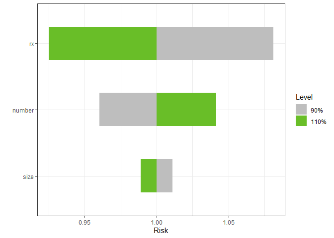

<div>
<table>
<tr>
<td>

</td>
</tr>
</table>
</div>

|                                                                               <sub>Actions</sub>                                                                               |                                                                  <sub>Code Coverage</sub>                                                                  | <sub>Website</sub> |     |     |     |     |
|:------------------------------------------------------------------------------------------------------------------------------------------------------------------------------:|:----------------------------------------------------------------------------------------------------------------------------------------------------------:|:------------------:|:---:|:---:|:---:|:---:|
| [](https://github.com/bertcarnell/tornado/actions/workflows/r-cmd-check.yml) | [](https://codecov.io/github/bertcarnell/tornado?branch=master) |         NA         |     |     |     |     |

tornado
=======

`tornado` plots for model sensitivity analysis.

`tornado` [website](https://bertcarnell.github.io/tornado/)

Installation
------------

You can also install the development version of `lhs` from github with:

``` r
if (!require(devtools)) install.packages("devtools")
devtools::install_github("bertcarnell/tornado")
```

Quick Start - Torndao Plots
---------------------------

### Linear Models

``` r
lm1 <- lm(mpg ~ cyl*wt*hp, data = mtcars)
torn1 <- tornado(lm1, type = "PercentChange", alpha = 0.10)
plot(torn1, xlabel = "MPG")
```


### Generalized Linear Models

``` r
glm2 <- glm(vs ~ wt + disp + cyl, data = mtcars, family = binomial(link = "logit"))
torn2 <- tornado(glm2, type = "PercentChange", alpha = 0.10)
plot(torn2, xlabel = "V or Straight Engine")
```


### Censored Data

``` r
survreg3 <- survival::survreg(survival::Surv(futime, fustat) ~ ecog.ps + rx + age + resid.ds, 
                              survival::ovarian, dist = 'weibull', scale = 1)
torn3 <- tornado(survreg3, modeldata = survival::ovarian, type = "PercentChange", alpha = 0.10)
plot(torn3, xlabel = "Survival Time")
```


``` r
coxph4 <- survival::coxph(survival::Surv(stop, event) ~ rx + size + number,
                          survival::bladder)
torn4 <- tornado(coxph4, modeldata = survival::bladder, type = "PercentChange",
                 alpha = 0.10)
plot(torn4, xlabel = "Risk")
```


