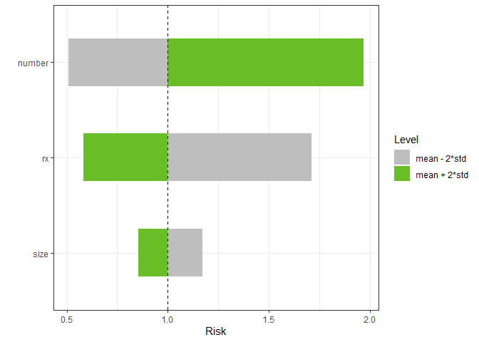
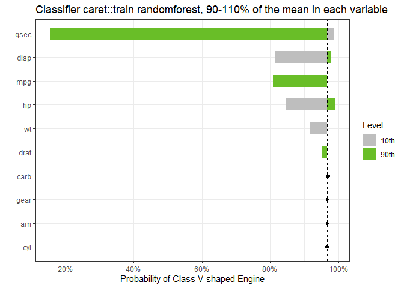

<div>

<table>
<tr>
<td>

</td>
</tr>
</table>

</div>

|                                                                               <sub>Actions</sub>                                                                               |                                                                  <sub>Code Coverage</sub>                                                                  |                                          <sub>Website</sub>                                          |                                     <sub>Downloads</sub>                                     |                                              <sub>CRAN</sub>                                               |
|:------------------------------------------------------------------------------------------------------------------------------------------------------------------------------:|:----------------------------------------------------------------------------------------------------------------------------------------------------------:|:----------------------------------------------------------------------------------------------------:|:--------------------------------------------------------------------------------------------:|:----------------------------------------------------------------------------------------------------------:|
| [](https://github.com/bertcarnell/tornado/actions/workflows/r-cmd-check.yml) | [](https://codecov.io/github/bertcarnell/tornado?branch=master) | [](https://bertcarnell.github.io/tornado/) | [](https://cran.r-project.org/package=tornado) | [](https://cran.r-project.org/package=tornado) |

# tornado

`tornado` plots for model sensitivity analysis.

[website](https://bertcarnell.github.io/tornado/)

## Installation

You can also install the development version of `tornado` from github
with:

``` r
if (!require(devtools)) install.packages("devtools")
devtools::install_github("bertcarnell/tornado")
```

## Quick Start - Torndao Plots

### Linear Models

``` r
lm1 <- lm(mpg ~ cyl*wt*hp, data = mtcars)
torn1 <- tornado(lm1, type = "PercentChange", alpha = 0.10)
plot(torn1, xlabel = "MPG", geom_bar_control = list(width = 0.5))
```

<!-- -->

### Generalized Linear Models

Plots can also be created for the range of the input data

``` r
glm2 <- glm(vs ~ wt + disp + cyl, data = mtcars, family = binomial(link = "logit"))
torn2 <- tornado(glm2, type = "ranges", alpha = 0.10)
plot(torn2, xlabel = "Probability of Straight Engine", geom_bar_control = list(width = 0.5))
```

<!-- -->

Plots can include factors and percentiles of the data as well.

``` r
mydata <- mtcars
mydata$am <- factor(mtcars$am)
mydata$vs <- factor(mtcars$vs)
glm2 <- glm(mpg ~ wt + cyl + am + vs, data = mydata, family = gaussian)
torn2 <- tornado(glm2, type = "percentiles", alpha = 0.10)
plot(torn2, xlabel = "MPG", 
     geom_bar_control = list(width = 0.5),
     sensitivity_colors = c("#E41A1C", "#377EB8"),
     geom_point_control = list(fill = "red", col = "red", size = 3))
```

<!-- -->

### Censored Data

Accelerated Failure Model

``` r
survreg3 <- survival::survreg(survival::Surv(futime, fustat) ~ ecog.ps + rx + age + resid.ds, 
                              survival::ovarian, dist = 'weibull', scale = 1)
torn3 <- tornado(survreg3, modeldata = survival::ovarian, type = "PercentChange", alpha = 0.10)
plot(torn3, xlabel = "Survival Time", geom_bar_control = list(width = 0.5))
```

<!-- -->

Cox Proportional Hazard Model with 2 Standard Deviation bars

``` r
coxph4 <- survival::coxph(survival::Surv(stop, event) ~ rx + size + number,
                          survival::bladder)
torn4 <- tornado(coxph4, modeldata = survival::bladder, type = "StdDev",
                 alpha = 2)
plot(torn4, xlabel = "Risk", geom_bar_control = list(width = 0.5))
```

<!-- -->

### Machine Learning Models from caret::train

The `plot` method can also return a ggplot object

``` r
mydat <- mtcars
mydat$am <- factor(mydat$am, labels = c("A", "M"))
mydat$vs <- factor(mydat$vs, labels = c("V", "S"))
mydat$cyl <- factor(mydat$cyl)
mydat$gear <- factor(mydat$gear)
mydat$carb <- factor(mydat$carb)

gtest <- caret::train(x = subset(mydat, select = -vs), y = mydat$vs, method = "rf")
torn <- tornado(gtest, type = "percentiles", alpha = 0.10, class_number = 1)
g <- plot(torn, plot = FALSE, xlabel = "Probability of Class V-shaped Engine", geom_bar_control = list(width = 0.5))
g <- g + ggtitle("Classifier caret::train randomforest, 90-110% of the mean in each variable")
plot(g)
```

<!-- -->
